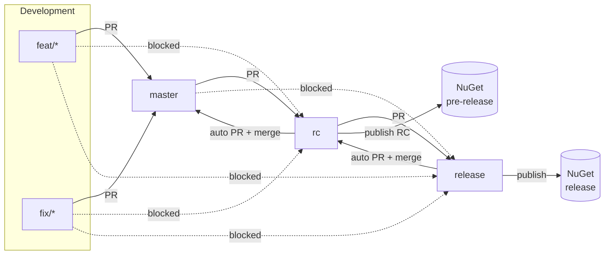

## Branching & Release Flow

```mermaid
flowchart LR
  subgraph Development
    FEAT[feat/*]
    FIX[fix/*]
  end

  MASTER[master]
  RC[rc]
  RELEASE[release]

  NUGET_RC[(NuGet\npre-release)]
  NUGET_REL[(NuGet\nrelease)]

  %% Development flow
  FEAT -->|PR| MASTER
  FIX -->|PR| MASTER

  %% Promotion flow
  MASTER -->|PR| RC
  RC -->|PR| RELEASE

  %% Publishing
  RC -->|publish RC| NUGET_RC
  RELEASE -->|publish| NUGET_REL

  %% Automatic merge-back (sync)
  RC -->|auto PR + merge| MASTER
  RELEASE -->|auto PR + merge| RC

  %% Guards / blocked paths
  FEAT -. blocked .-> RC
  FEAT -. blocked .-> RELEASE
  FIX  -. blocked .-> RC
  FIX  -. blocked .-> RELEASE
  MASTER -. blocked .-> RELEASE

```