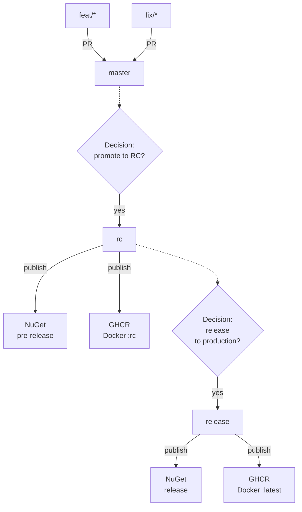

# Branching & Release Flow

This document describes the **full big picture** of the branching strategy and release process used in the repository.
It covers the complete lifecycle from development to published artifacts.

---

## Development

- All development work is done in short-lived branches:
  - `feat/*`
  - `fix/*`
- Changes are merged into `master` via Pull Requests.
- This stage focuses on fast iteration and continuous integration.
- No artifacts are published from `master`.

---

## Release Candidate (RC)

- Promotion to RC is a **manual decision**.
- Flow:
  - `master` → `rc`
- Published artifacts:
  - NuGet **pre-release**
  - Docker image published to **GHCR** with the `:rc` tag
- RC represents a stabilized snapshot intended for validation and testing.

---

## Production Release

- Production release is a **manual decision**, taken after RC validation.
- Flow:
  - `rc` → `release`
- Published artifacts:
  - NuGet **release**
  - Docker image published to **GHCR** with the `:latest` tag
- This stage represents a production-ready release.

---

## Principles

- The diagram represents the **entire release flow**, from feature development to published artifacts.
- There is no direct access to `rc` or `release` branches.
- All releases are driven by explicit, manual decisions.
- Artifacts are published only from `rc` and `release`.
- Branches `rc` and `release` act as the single source of truth for released artifacts and versioning.

